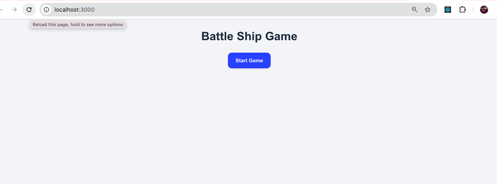
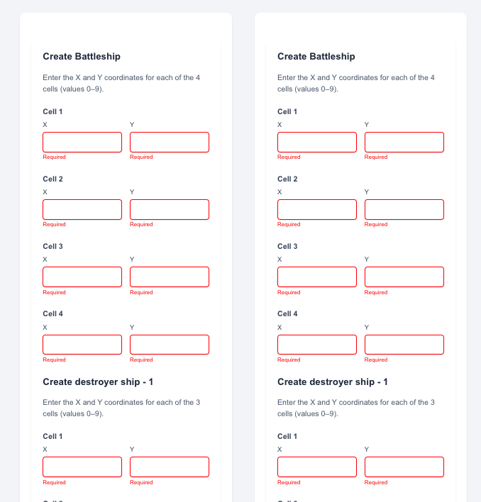
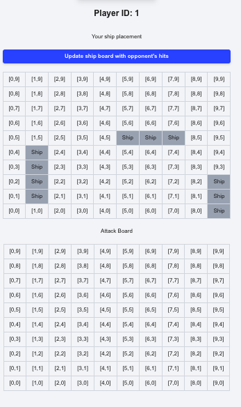
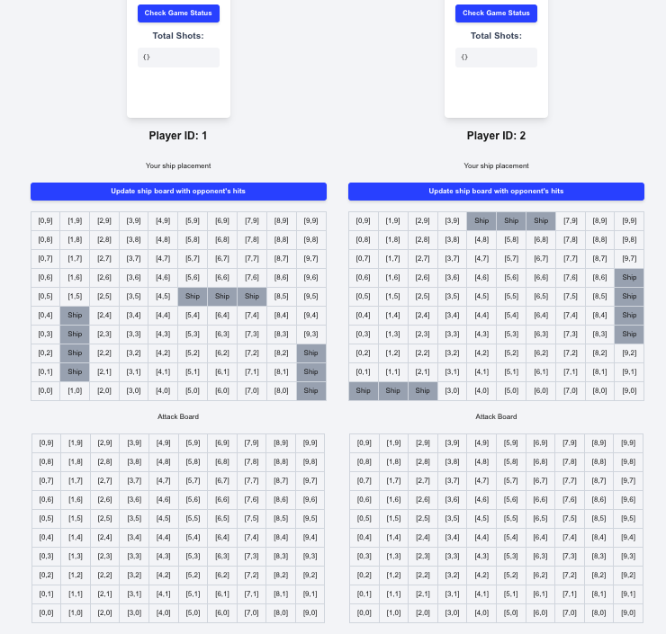
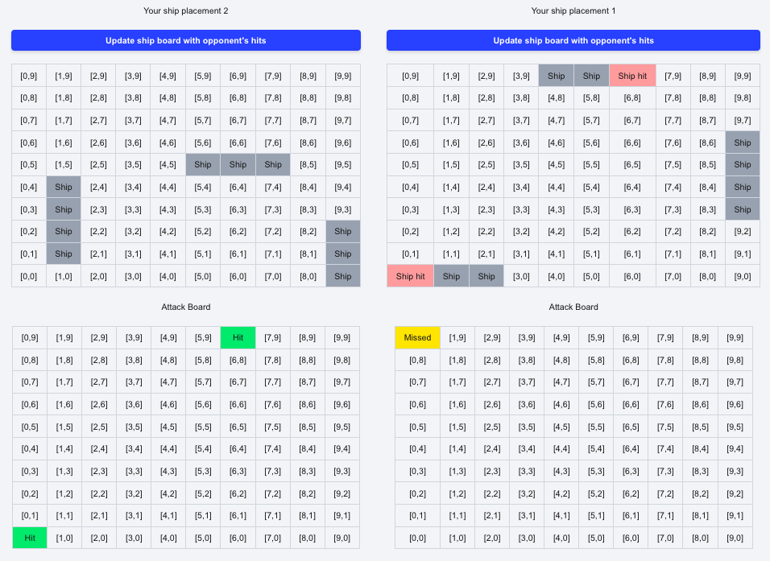
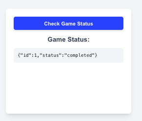

1. This game is not a real time game - Ship placement of each player is visible in visible in the same screen
2. Game id considered as the session identification
3. refered to an AI agent only to write tailwind CSS
4. run locally `npm run dev`
5. increase gameId by 1 to start a new session (game) `src/lib/HttpClient.ts` line number `22` && clear the database - to remove in progress games

<h3>Design patterns used:</h3>

1. Singleton Pattern - service layer is always using one shared axios instance
2. Decorator Pattern - HttpClient class uses axios interceptor to attach session token to the request header. By doing this API requests are wrapped with an additional property
3. used error boundary concept in react - to prevent the failures affecting to rest of the app

# Game Flow

1. start game by clicking button

   

2. each player can create ship for all the ship types

   

3. After creating the ships a given player can see thier ship board and attack board (all the 4 boards are visible in same UI for this demo)

   

   

4. players can take turns to attack cells and will be notified whether they missed or hit. They can update thier ship board by clicking the top button

   

5. players can check game status by clicking a button

